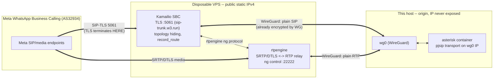

# Option 2: Kamailio SBC on a disposable VPS in front of Meta WhatsApp Calling

Status: **plan only**, nothing implemented. Written 2026-08-13 against `aistack/main`
at commit `c84ba32fcb`. Verified against actual repo files where cited.

**Caveat on Option 3 state**: at plan-writing time, Option 3 (direct exposure of
`sip-trunk.w3.run:5061` from this host) had **not landed** in this tree —
`compose.yml`, `docker/etc-asterisk/pjsip.conf` have no TLS transport, no
`docker/scripts/` directory, no `sip-trunk.w3.run` reference anywhere (grepped the
whole repo). A parallel effort is building it concurrently, and its shape was already
shifting mid-write of this document: `docker/etc-asterisk/secrets/.gitignore` picked
up a reference to `docker/scripts/issue-cert.sh` (a Let's Encrypt issuance script
expected to drop `fullchain.pem`/`privkey.pem` under `secrets/tls/`) while
`docker/scripts/` itself still doesn't exist yet on disk. Treat every Option-3 path,
script name, and transport name below (including the guessed
`meta-allowlist.sh`/`DOCKER-USER` allowlist mechanism, which is not yet confirmed to
exist under that name) as **provisional**. Sections 5–6 describe the *anticipated*
Option-3 shape from the task brief; **before executing them, re-verify actual
paths/names** (`git log`, `git grep -i sip-trunk`, `git grep -i meta`, `ls
docker/scripts/`).

---

## 1. Objective & success criteria

Stop exposing this host's IP to Meta entirely. Put a cheap, disposable VPS in front as
a SIP edge (Kamailio SBC + rtpengine media relay), reachable from this host only over
WireGuard, so Meta's WhatsApp Business Calling platform only ever learns the VPS's IP.

**Success criteria**:

1. Inbound and outbound test calls between Meta's WhatsApp Business Calling test
   number and an Asterisk extension complete end-to-end with two-way audio.
2. `sip-trunk.w3.run` resolves to the VPS's static IPv4, not this host's.
3. Every SIP/SDP element visible to Meta (`Record-Route`, `Via`, `Contact`, SDP
   `o=`/`c=`) shows only the VPS's IP — zero occurrences of this host's public IP or
   its Tailscale IP (`100.69.165.55`, per `compose.yml`'s `GF_SERVER_ROOT_URL` and
   Caddy's port bindings).
4. Option 3 fully retired: its published port(s) (anticipated `5061/tcp` + any RTP/
   SRTP range) closed, the `DOCKER-USER` AS32934 allowlist chain removed, any
   refresh cron/timer deleted.
5. `docs-internal/security.mdx` and the debug-asterisk skill updated to describe the
   new topology (tracked as a Section 6 follow-up, not detailed here).

**No-infra alternative** (Option 1, context only): route through a hosted SIP trunk
provider (Telnyx or SignalWire) that already terminates Meta's SIP-TLS/SRTP — no VPS,
no Kamailio, no WireGuard, but recurring per-minute fees and another vendor in path.

---

## 2. Architecture



**TLS termination — at Kamailio, on the VPS**, with the Let's Encrypt cert for
`sip-trunk.w3.run`. The VPS→origin leg rides WireGuard, which is already an
encrypted/authenticated tunnel between two known peers, so wrapping it in a second TLS
layer buys nothing. Consequence: `pjsip.conf`'s existing `transport-udp` pattern
(currently `bind=0.0.0.0:5060`) can be reused almost as-is for the Meta trunk, just
re-bound to the WireGuard IP as plain UDP/TCP instead of a public TLS bind.

**Media relay — rtpengine is required, not optional.** Two options:

- *DTLS-SRTP passthrough* (Kamailio rewrites signaling only, media flows Meta ⇄
  Asterisk directly): rejected — requires Asterisk to hold a public RTP address,
  defeating the whole point.
- *rtpengine terminates SRTP/DTLS on the VPS, relays plain RTP to Asterisk over
  WireGuard* (recommended): rtpengine holds the public-facing SRTP session; Kamailio's
  `rtpengine` module rewrites SDP `c=`/`o=` on both legs so each side sees only the IP
  it should (VPS public IP toward Meta, WireGuard IP toward Asterisk).

rtpengine, not Kamailio, is what actually removes the origin's *media* exposure —
Kamailio alone only hides the signaling IP.

---

## 3. VPS requirements & candidate providers

- **Sizing**: 1 vCPU / 1 GB RAM is plenty for Kamailio + rtpengine at this call volume
  (a handful to a few dozen concurrent calls). The kernel rtpengine module isn't
  needed at this scale — skip it, revisit only if CPU becomes a bottleneck.
- **Bandwidth**: G.711 ulaw ≈ 64 kbps payload; budget ~100 kbps/direction/call with
  RTP+UDP+IP overhead (~200 kbps round-trip per call). Ten concurrent calls ≈ 2 Mbps —
  trivial for any modern VPS tier. Not a sizing constraint.
- **Must-have**: a dedicated **static public IPv4** (not shared/CGNAT) for
  `sip-trunk.w3.run`'s A record — check the provider doesn't gate this behind a paid
  add-on. IPv6 is a bonus, not required.
- **Candidates** (any work; pick on price/region): Hetzner Cloud (CX22, cheapest),
  DigitalOcean, Vultr, Linode/Akamai, OVH, Contabo. No feature differentiator matters
  at this scale beyond "Linux VM, public static IPv4, configurable firewall."
- **Region**: prefer proximity to *this host* to minimize WireGuard RTT on the
  VPS↔origin leg (affects call-setup/audio latency). No strong requirement to be near
  Meta's infra specifically.

---

## 4. Step-by-step VPS build

### 4.1 WireGuard vs. reusing Tailscale

This host is already on a tailnet (`100.69.165.55`). Comparison:

| | Tailscale (join VPS to tailnet) | Raw WireGuard (dedicated wg0, 2 peers) |
|---|---|---|
| Setup | Minutes | ~30 min (keygen, config, systemd both ends) |
| MTU | Fixed ~1280 by default | Fully tunable to actual path MTU |
| Path | Direct P2P, but **silently falls back to DERP relay** (added, variable latency/jitter) if NAT traversal fails | Direct only — fails loudly, no silent degradation |
| Blast radius | VPS joins the whole tailnet | Exactly two peers |
| Ops access | Tailscale SSH "for free" | Needs its own SSH path, or Tailscale added separately |

**Recommendation**: dedicated raw `wg0` for the SIP/RTP data path — DERP fallback is
the wrong failure mode for live media (silent jitter/latency, not a clean error). Also
join the VPS to the existing tailnet *separately*, purely for admin/SSH, so ops access
doesn't depend on the data tunnel's health. Two interfaces, two purposes.

Config sketch (both ends):

```ini
# VPS: /etc/wireguard/wg0.conf (SKETCH)
[Interface]
Address = 10.99.0.1/30
PrivateKey = <vps-private-key>
ListenPort = 51820
MTU = 1420   # tune down if PMTUD blackholes appear, see Section 8

[Peer]
PublicKey = <origin-public-key>
AllowedIPs = 10.99.0.2/32
PersistentKeepalive = 25
```

```ini
# Origin host: /etc/wireguard/wg0.conf (SKETCH)
[Interface]
Address = 10.99.0.2/30
PrivateKey = <origin-private-key>
MTU = 1420

[Peer]
PublicKey = <vps-public-key>
Endpoint = <vps-public-ip>:51820
AllowedIPs = 10.99.0.1/32
PersistentKeepalive = 25
```

Bring up with `systemctl enable --now wg-quick@wg0` on both ends. Host-level, outside
Docker — doesn't touch `compose.yml` directly (see Section 5 for reaching the
`asterisk` container over it).

### 4.2 Kamailio install + minimal config

Install from the official Kamailio APT repo (current stable, not the distro package):

```bash
# SKETCH -- verify current install steps at kamailio.org/docs
curl https://deb.kamailio.org/kamailiodebkey.gpg | gpg --dearmor -o /usr/share/keyrings/kamailio.gpg
echo "deb [signed-by=/usr/share/keyrings/kamailio.gpg] https://deb.kamailio.org/kamailio58 $(lsb_release -sc) main" \
  > /etc/apt/sources.list.d/kamailio.list
apt update && apt install kamailio kamailio-tls-modules kamailio-outbound-modules
```

`kamailio.cfg` sketch — minimal, single upstream, no dispatcher (only one origin):

```
# /etc/kamailio/kamailio.cfg (SKETCH -- illustrates shape only, not deployable)
listen = tls:<VPS_PUBLIC_IP>:5061
enable_tls = yes
modparam("tls", "config", "/etc/kamailio/tls.cfg")
loadmodule "rtpengine.so"
modparam("rtpengine", "rtpengine_sock", "udp:127.0.0.1:22222")

request_route {
    if (!has_totag()) {
        rtpengine_offer("SRTP-accept SDES-off");   # terminate Meta's SRTP
        record_route();
        $du = "sip:10.99.0.2:5060";                 # forward to origin over wg0, plain UDP
        t_relay(); exit;
    }
    if (loose_route()) { t_relay(); exit; }          # in-dialog: ACK/BYE/re-INVITE
}

onreply_route {
    if (status =~ "200") { rtpengine_answer("SRTP-accept"); }
}
```

`tls.cfg` sketch: `private_key`/`certificate` pointing at
`/etc/letsencrypt/live/sip-trunk.w3.run/{privkey,fullchain}.pem`, `method = TLSv1.2+`.

This sketch omits real work still needed: Meta's actual auth model for the SIP leg
(WhatsApp Calling reportedly doesn't use SIP digest — verify against Meta's API docs
before finalizing trust logic in `request_route`), and full failure/dialog-route
handling. Validate with `kamailio -c -f kamailio.cfg` before deploy.

### 4.3 rtpengine install

```bash
# SKETCH -- Debian/Ubuntu package from the Sipwise repo
apt install rtpengine   # after adding deb.sipwise.com per rtpengine docs
```

`/etc/rtpengine/rtpengine.conf` sketch:

```ini
[rtpengine]
interface = public/<VPS_PUBLIC_IP>;wg/10.99.0.1
listen-ng = 127.0.0.1:22222
port-min = 30000
port-max = 30100   # open in VPS firewall (4.5); Meta's media-source IPs may differ
                   # from its signaling-source IPs -- allowlist broadly across AS32934
```

Kernel module (`xt_RTPENGINE`) not required at this scale — skip initially.

### 4.4 Let's Encrypt on the VPS

```bash
# SKETCH
apt install certbot
certbot certonly --standalone -d sip-trunk.w3.run --deploy-hook "systemctl restart kamailio"
```

certbot's packaged timer handles renewal; `--deploy-hook` restarts Kamailio to pick up
the renewed cert (a hard restart is fine at this call volume). `--standalone` needs
port 80 free momentarily — no conflict since the VPS runs nothing else on it.

### 4.5 VPS firewall

- `22/tcp` — SSH, restricted to admin IP or the Tailscale control-plane interface.
- `5061/tcp` — Kamailio TLS, **allowlisted to Meta's AS32934 prefixes only**. Port the
  logic of the anticipated `docker/scripts/meta-allowlist.sh` (Option 3 — refreshes
  AS32934 prefixes from RIPEstat/bgp.he.net into an ipset on a timer) to run against
  the VPS's own `iptables`, not `DOCKER-USER` (no Docker needed on this box). Verify
  the script's real name/path first (see top-of-doc caveat).
- `30000:30100/udp` (rtpengine range, 4.3) — allow from AS32934 broadly, since media-
  source IPs may not match signaling-source IPs.
- WireGuard's listen port (`51820/udp`) — restrict to the origin's IP if static;
  otherwise leave open (WireGuard's own crypto auth makes this low-risk).
- Deny all other inbound by default.

### 4.6 fail2ban

Jail watching Kamailio's syslog for repeated auth failures/malformed-INVITE floods,
banning at iptables as a second layer behind the AS32934 allowlist (catches a bad
actor *within* AS32934, or an allowlist gap). Kamailio's own `pike` module is a
tighter-integrated alternative/complement worth considering instead.

---

## 5. Origin-side changes in this repo

**Current state (verified)**: `docker/etc-asterisk/pjsip.conf` has exactly two
transports today — `transport-udp` (`bind=0.0.0.0:5060`) and `transport-ws`
(rides `http.conf`'s port 8088). No TLS transport exists. `compose.yml`'s `asterisk`
service has **no active port publishes** (the `5060/udp` / `10000-10100/udp` block is
commented out; `rtp.conf` sets `rtpstart=10000`/`rtpend=10100` to match if ever
uncommented). `http.conf`'s TLS directives are also commented out. So Option 3, when
it lands, *adds* a TLS transport and an active port publish — there's nothing today to
undo beyond what Option 3 itself introduces.

**Changes for Option 2** (assuming Option 3 adds a `[transport-tls-meta]` bound
`0.0.0.0:5061` with `external_media/signaling_address` set to this host's public IP):

1. **New transport**, bound to the WireGuard IP, plain UDP/TCP instead of TLS (TLS
   already terminates at Kamailio):

   ```
   ; docker/etc-asterisk/pjsip.conf -- SKETCH
   [transport-meta-wg]
   type=transport
   protocol=udp
   bind=0.0.0.0:5060
   external_media_address=<VPS_PUBLIC_IP>      ; defense-in-depth; rtpengine rewrites
   external_signaling_address=<VPS_PUBLIC_IP>  ; the Meta-facing SDP regardless
   ```

   The container's `aistack` bridge network doesn't share an IP namespace with the
   host's `wg0`. Reach it by **publishing the port scoped to the WireGuard IP**,
   mirroring `compose.yml`'s existing Caddy pattern (`"100.69.165.55:7231:80"`,
   interface-scoped because `ufw` doesn't filter Docker's DNAT'd published ports —
   see `docs-internal/security.mdx`):

   ```yaml
   # compose.yml, asterisk service -- SKETCH
   ports:
     - "10.99.0.2:5060:5060/udp"
   ```

   `bind=0.0.0.0:5060` inside `pjsip.conf` is fine as-is — the interface restriction
   happens at the Docker publish level, same as Caddy. This is the recommended
   approach: zero new pattern, reuses what's already in this repo. RTP itself
   (`10000-10100/udp`) needs the same scoped-publish treatment so rtpengine can relay
   media into the container.

2. **Identify by the VPS's WireGuard IP** as the single trusted peer, not an
   `identify` block enumerating AS32934 ranges (which Option 3 needs since Meta
   connects directly). Meaningfully simpler trust boundary:

   ```
   ; docker/etc-asterisk/pjsip.conf -- SKETCH
   [meta-trunk-identify]
   type=identify
   endpoint=meta-trunk
   match=10.99.0.1   ; the VPS's wg0 IP -- only address this transport should hear from

   [meta-trunk]
   type=endpoint
   transport=transport-meta-wg
   context=from-meta
   ```

3. **`compose.yml`**: remove whatever active port publish Option 3 added for
   `5061/tcp` and any direct RTP/SRTP range — unused once Kamailio/rtpengine own the
   public legs.
4. **Delete** the anticipated `docker/scripts/meta-allowlist.sh` (verify real path
   first), its cron/systemd timer, and the `DOCKER-USER` iptables rules it manages.
5. **DNS flip**: lower `sip-trunk.w3.run`'s TTL ahead of cutover, then repoint the A
   record to the VPS's IPv4 (sequencing in Section 6).

---

## 6. Cutover plan with rollback

1. **Pre-work**, no user-facing change: build the VPS stack (Section 4) and make the
   origin-side additions (Section 5, items 1–2) while DNS still points at this host —
   these are additive, so Option 3's live path keeps serving Meta unaffected.
2. **Lower DNS TTL** (e.g. to 300s) at least one old-TTL-period before the flip.
3. **Validate the VPS path directly by IP** (bypassing DNS) — TLS handshake, INVITE
   routing over WireGuard, a full call — before it's the thing Meta actually dials.
4. **Run the test matrix** (Section 7) against the VPS path: full call w/ two-way
   audio, DTMF, hold/resume, and a call held open several minutes (catches WireGuard/
   NAT keepalive or session-timer issues that only surface over time).
5. **Flip DNS** to the VPS's IPv4. Confirm against Meta's API docs whether calls
   re-resolve per-attempt or cache longer than TTL suggests, before assuming instant
   cutover.
6. **Soak** (24–72h): keep Option 3's listener config present but unused (DNS no
   longer routes to it) so rollback is DNS-only during this window.
7. **Rollback**, if needed: revert the DNS record. If soak already passed and Option 3
   was fully deleted (step 8), `git revert` the retirement commit, redeploy
   (`docker compose up -d asterisk`), restore the iptables allowlist, then flip DNS
   back.
8. **Full Option 3 retirement**, once soak passes clean: execute Section 5 items 3–4,
   and update `docs-internal/security.mdx` + the debug-asterisk skill for the new
   topology.

---

## 7. Testing checklist

- **TLS**: `openssl s_client -connect sip-trunk.w3.run:5061 -servername sip-trunk.w3.run` — verify chain, hostname, expiry.
- **SIP probes**: `sipsak -s sip:sip-trunk.w3.run:5061 -T` (TLS OPTIONS ping); a
  scripted `sipp` INVITE/200/ACK/BYE scenario for plumbing checks without a real call.
- **Echo/test call**: Meta's WhatsApp Business Calling test number (Meta Business
  dashboard calling test tool) — real end-to-end call, confirm two-way audio.
- **RTP flow**: `rtpengine-ctl list totals` (or `ng` query) on the VPS during a live
  call, confirming packets actually flow through the relay, not just that signaling
  succeeded.
- **Origin-IP-leak check** (the core security property this plan delivers): capture
  the VPS's Meta-facing interface during a live call (`tcpdump -i eth0 port 5061 -w
  meta-leg.pcap`) and inspect INVITE/200 OK SDP. Grep for this host's public IP, the
  Tailscale IP `100.69.165.55`, and the WireGuard tunnel IPs (`10.99.0.1`/`.2`).
  **Expect zero matches** — `Record-Route`/`Via`/`Contact`/SDP `o=`/`c=` must show
  only the VPS's public IP. Any match is a topology-hiding bug (likely a missing SDP
  rewrite in `rtpengine_offer`/`rtpengine_answer`) to fix before cutover.
- **Failure mode**: kill the WireGuard tunnel mid-call, confirm Kamailio times out
  cleanly rather than hanging.

---

## 8. Effort estimate, risks, mitigations

**Effort** (rough, one engineer, sequential): VPS + WireGuard ~0.5 day; Kamailio +
rtpengine install/config (SRTP/DTLS interop with Meta is the fiddliest part) ~1–1.5
days; Let's Encrypt + firewall + fail2ban ~0.5 day; origin-side `pjsip.conf`/
`compose.yml` changes ~0.5 day; testing + cutover ~0.5–1 day. **Total: ~3–4
engineer-days**, plus buffer for Meta test-number/dashboard access lag.

| Risk | Mitigation |
|---|---|
| WireGuard MTU causes RTP fragmentation/loss | Start `wg0` MTU at 1420, test with `ping -M do -s <size>` PMTUD probes before cutover, lower if blackholing |
| rtpengine's SRTP/DTLS termination incompatible with Meta's exact handshake params | Verify Meta's WhatsApp Calling API docs before finalizing `rtpengine_offer()` flags; test against Meta's real test number early; keep Option 3 live as fallback until confirmed |
| Kamailio config complexity vs. team's Asterisk-centric familiarity | Keep `kamailio.cfg` minimal (no dispatcher/load-balancing — only one origin) |
| Single VPS is a SPOF | Keep VPS config (WG keys, `kamailio.cfg`, `rtpengine.conf`, firewall) in version control/Ansible for fast rebuild; hot standby left as an open question (Section 9) |
| Meta's AS32934 ranges rotate over time (pre-existing Option 3 problem) | Port the allowlist-refresh mechanism to the VPS — the risk moves, doesn't disappear |

---

## 9. Open questions for the user

1. **VPS provider/budget** — preference among Hetzner/DigitalOcean/Vultr/Linode/OVH/
   Contabo, or a budget ceiling? (Section 3 sizing implies ~$4–6/mo regardless.)
2. **Reuse Tailscale or dedicated WireGuard?** — Section 4.1 recommends dedicated
   `wg0` for data-plane, Tailscale optionally joined separately for admin. Confirm
   acceptable vs. wanting everything on one tailnet.
3. **Soak period length** before deleting Option 3 (Section 6 suggests 24–72h) — any
   preference or deadline?
4. **Keep Option 3 retrievable** (git tag/branch/doc note) after retirement, or delete
   outright once validated?
5. **Standby/second VPS** for redundancy against the SPOF (Section 8) — worth the
   cost/complexity, or is a documented fast-rebuild runbook sufficient?
