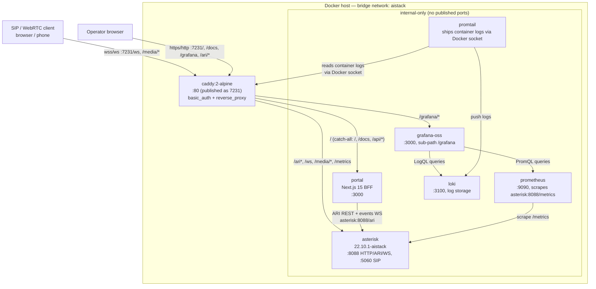

## What this is

This repository is the upstream `asterisk/asterisk` tree with one extra branch, `aistack/main`, forked from tag `22.10.1`. On top of stock Asterisk 22.10.1, that branch adds:

1. A **native, host-installed build** at `/usr/sbin/asterisk` (`asterisk -V` reports `Asterisk 22.10.1`), built with `./configure --with-pjproject-bundled --with-jansson-bundled`.
2. A **Docker Compose stack** that packages the same source tree into a container image and wires it up with Prometheus, Grafana, Loki/Promtail, a Next.js admin portal, and a Caddy edge proxy, all reachable through one published port.

Both build paths compile the exact same source — the container build (`Dockerfile`) runs `make distclean` before configuring, so nothing from the host build is reused; it's a from-scratch build inside the image with the same flags.

<Note>
  There is no code change to Asterisk itself on this branch relative to the `22.10.1` tag — everything added is deployment tooling (`Dockerfile`, `docker/`, `portal/`, `compose.yml`).
</Note>

## Architecture

Seven containers share one Docker bridge network, `aistack`. Caddy is the **only** service that publishes a port to the host (`7231:80`); everything else is reached by service name over the internal network.

## Services

| Service | Image | Role | Published port |
| --- | --- | --- | --- |
| `asterisk` | `asterisk:22.10.1-aistack` (built locally, ~322MB, `ubuntu:24.04` multi-stage) | SIP/ARI/WS engine. Signalling and media both ride over WebSocket via the built-in HTTP server on `:8088`. | none — internal only |
| `caddy` | `caddy:2-alpine` | Sole edge proxy. Single published port `7231:80`. Routes by path, terminates HTTP Basic Auth on UI/metrics routes, logs each request as JSON to stdout. | `7231:80` |
| `portal` | built from `portal/` (Next.js 15, `node:22-alpine`) | Read-only ARI dashboard \+ `/docs` page. BFF pattern — ARI credentials never reach the browser. | none — behind Caddy only |
| `grafana` | `grafana/grafana-oss:latest` | Dashboards over Asterisk metrics and logs, mounted at `/grafana` in sub-path mode. Anonymous Viewer access enabled. | none — behind Caddy only |
| `prometheus` | `prom/prometheus:latest` | Scrapes `asterisk:8088/metrics` every 10s. | none — not even behind Caddy by default (also proxied at `/metrics` for convenience) |
| `loki` | `grafana/loki:latest` | Log storage for the stack, single-binary mode, filesystem backend, 7-day retention. | none — internal only |
| `promtail` | `grafana/promtail:latest` | Discovers this compose project's containers over the Docker socket and ships their logs to Loki. | none — internal only |

See [Docker stack](/setup/docker-stack) for the full Compose file walkthrough, [Observability](/reference/observability) for the metrics/logging pipeline, and [Build from source](/setup/build-from-source) for the native host build.

## URL map

Everything below is served through Caddy at `http://100.69.165.55:7231` (Tailscale) or `http://localhost:7231` on the Docker host itself.

| Path | Backend | Auth | What it is |
| --- | --- | --- | --- |
| `/` | portal | Caddy basic auth | Live dashboard — channels, endpoints, health |
| `/docs` | portal | Caddy basic auth | In-app operator docs (`portal/app/docs/page.tsx`) |
| `/api/*` | portal | Caddy basic auth | Portal's own BFF routes (health/channels/endpoints/events) |
| `/grafana/*` | grafana:3000 | Caddy basic auth (plus optional Grafana login for editing) | Dashboards, sub-path mode. Bare `/grafana` 308-redirects here. |
| `/ws` | asterisk:8088 | none (SIP client can't send auth headers) | SIP over WebSocket signalling, PJSIP `transport-ws`, subprotocol `sip` |
| `/media/<id>` | asterisk:8088 | none | Per-call media/control socket, `chan_websocket`, subprotocol `media` |
| `/ari/*` | asterisk:8088 | ARI's own basic auth (`aistack` user) | Asterisk REST Interface, including the events WebSocket at `/ari/events` |
| `/metrics` | asterisk:8088 | Caddy basic auth | `res_prometheus` text-format metrics |

`loki` and `promtail` have no route through Caddy at all — they're reached only from Grafana and from each other over the internal `aistack` network. For full detail on the auth layering and default credentials, see [Security](/security).

<Card title="Live stack" icon="link" href="http://100.69.165.55:7231">
  Reachable over Tailscale at [http://100.69.165.55:7231](http://100.69.165.55:7231) (basic auth required for `/`, `/docs`, `/grafana`, `/metrics`).
</Card>
