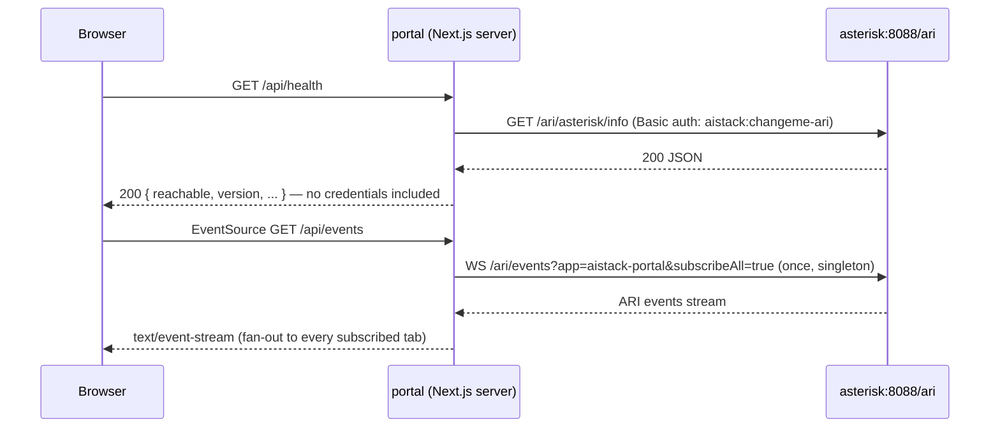

`portal/` is a Next.js 15 app (`next ^15.4.6`, React 19) that gives a read-only, live view of the Asterisk server: active channels, endpoint status, health, plus an in-app `/docs` page. It runs as the `portal` service in `compose.yml`, on the `aistack` network only — it never publishes a host port and is reached exclusively through Caddy (or directly by other containers at `portal:3000`).

## Architecture: BFF pattern

Portal is a **Backend-for-Frontend**: the browser never talks to Asterisk's ARI directly. Every ARI call goes through the portal's own server-side route handlers first.



### Why ARI credentials never reach the browser

`lib/ari.ts` reads `ARI_BASE_URL`, `ARI_USERNAME`, `ARI_PASSWORD` from `process.env` — server-side only, in a module never imported by client components. Every `app/api/*/route.ts` handler runs on the server (Next.js Route Handlers), does the authenticated ARI call there, and returns only the derived JSON the UI needs. The browser's only network calls are to the portal's own same-origin `/api/*` routes, which never echo the `Authorization` header or the credentials back.

```typescript
// portal/lib/ari.ts
const ARI_BASE_URL = process.env.ARI_BASE_URL ?? "http://asterisk:8088/ari";
const ARI_USERNAME = process.env.ARI_USERNAME ?? "aistack";
const ARI_PASSWORD = process.env.ARI_PASSWORD ?? "changeme-ari";

function authHeader(): string {
  const token = Buffer.from(`${ARI_USERNAME}:${ARI_PASSWORD}`).toString("base64");
  return `Basic ${token}`;
}
```

`ariGet<T>()` wraps every REST call with a 5-second `AbortController` timeout and throws a typed `AriError` on failure, so route handlers can degrade gracefully (render "unreachable" state) instead of 500ing.

## SSE fan-out singleton

`lib/ari-events.ts` implements `AriEventBus`, a module-level singleton that:

1. Opens **exactly one** upstream WebSocket to `asterisk:8088/ari/events?app=aistack-portal&subscribeAll=true`, lazily, on the first SSE subscriber.
2. Broadcasts every inbound ARI event verbatim (JSON passthrough) to every currently-connected browser tab.
3. Reconnects with exponential backoff (starts at 1s, doubles, caps at 30s) if the upstream socket drops, for as long as at least one subscriber remains.
4. Closes the upstream connection once the last subscriber disconnects — it reopens instantly on the next one.

```typescript
// portal/lib/ari-events.ts — survives across requests via globalThis,
// because Next.js keeps route handler modules resident for the server's lifetime.
const globalForAriBus = globalThis as unknown as { __ariEventBus?: AriEventBus };
export const ariEventBus = globalForAriBus.__ariEventBus ?? new AriEventBus();
globalForAriBus.__ariEventBus = ariEventBus;
```

`app/api/events/route.ts` turns each subscription into a Server-Sent Events stream (`text/event-stream`), forced onto the Node.js runtime (`export const runtime = "nodejs"`) because the `ws` package needs real sockets and can't run on the Edge runtime. It sends an immediate `_portal_status` greeting event, subscribes to the bus, and runs a 25-second comment-only keepalive ping so intermediary proxies (Caddy) don't time out an idle connection.

The client side (`components/Dashboard.tsx`) opens an `EventSource` to `/api/events` and, on any inbound event, does a debounced re-fetch of `/api/channels` and `/api/endpoints` rather than hand-diffing individual ARI event types — a "resync on any signal" strategy. A 15-second poll also runs alongside SSE as a safety net in case a proxy buffers or drops the stream.

## Routes

| Route | Backend call | Behavior on failure |
| --- | --- | --- |
| `GET /api/health` | `GET /ari/asterisk/info` | Always returns HTTP 200 with `reachable: false` — an unreachable Asterisk is a normal state to render, not a server error |
| `GET /api/channels` | `GET /ari/channels` | Returns `{ channels: [], error }` with HTTP 200 |
| `GET /api/endpoints` | `GET /ari/endpoints` | Returns `{ endpoints: [], error }` with HTTP 200 |
| `GET /api/events` | `WS /ari/events` (via the singleton bus) | SSE stream; degrades to periodic 15s polling on the client if the stream stalls |
| `GET /docs` | — (static content) | The in-app operator documentation page (`app/docs/page.tsx`) — endpoint anatomy, WebSocket client examples, reload commands, and a security checklist |

Every route returning "empty list \+ error field, HTTP 200" rather than a 4xx/5xx is a deliberate choice documented in the route files themselves — the dashboard is meant to render a clean "Asterisk unreachable" state instead of crashing.

## Environment variables

| Variable | Default | Scope | Notes |
| --- | --- | --- | --- |
| `ARI_BASE_URL` | `http://asterisk:8088/ari` | Server only | ARI REST base URL; the events WebSocket URL is derived from this (`http→ws`, `https→wss`) |
| `ARI_USERNAME` | `aistack` | Server only | ARI basic-auth username |
| `ARI_PASSWORD` | `changeme-ari` | Server only | ARI basic-auth password — never sent to the client |
| `NEXT_PUBLIC_GRAFANA_URL` | `http://localhost:3000` | **Build-time, baked into the client bundle** | Public URL for the "Open Grafana" link. See below. |
| `PORT` | `3000` | Runtime | Set by the Dockerfile |
| `HOSTNAME` | `0.0.0.0` | Runtime | Set by the Dockerfile |

None of `ARI_*` are `NEXT_PUBLIC_*`, so they're only ever readable in route handlers / server code — the browser only ever talks to this app's own `/api/*` routes.

## The `NEXT_PUBLIC_*` build-time gotcha

<Warning>
  `NEXT_PUBLIC_*` environment variables are inlined into the client (and prerendered server) bundle at `next build` time — **not** read at container runtime. Since `app/page.tsx` is statically prerendered, setting `NEXT_PUBLIC_GRAFANA_URL` only under `compose.yml`'s `environment:` block has **zero effect** on an already-built image. It must be passed as a Docker **build arg** and the image rebuilt whenever the value needs to change.
</Warning>

This is wired through explicitly in three places, all of which must agree:

```dockerfile
# portal/Dockerfile — build stage
ARG NEXT_PUBLIC_GRAFANA_URL
ENV NEXT_PUBLIC_GRAFANA_URL=$NEXT_PUBLIC_GRAFANA_URL
COPY --from=deps /app/node_modules ./node_modules
COPY . .
RUN npm run build
```

```yaml
# compose.yml — portal.build.args (this is what actually takes effect)
build:
  context: ./portal
  args:
    NEXT_PUBLIC_GRAFANA_URL: http://100.69.165.55:7231/grafana
```

```yaml
# compose.yml — portal.environment (kept in sync for documentation only;
# NOT read at runtime by the prerendered page)
environment:
  NEXT_PUBLIC_GRAFANA_URL: http://100.69.165.55:7231/grafana
```

If you change the Tailscale IP, the published port, or move Grafana's mount path, update the `build.args` value and run `docker compose build portal && docker compose up -d portal` — a plain `docker compose up -d portal` with no rebuild will keep serving the old URL baked into the existing image.

## Docker image

Three-stage build (`portal/Dockerfile`, `node:22-alpine`):

1. **`deps`** — `npm ci` with full devDependencies (needed to build).
2. **`build`** — `next build` with `NEXT_PUBLIC_GRAFANA_URL` baked in as above. `next.config.ts` sets `output: "standalone"`, so the build stage produces `.next/standalone/server.js` plus only the `node_modules` actually required at runtime.
3. **`runtime`** — copies `.next/standalone`, `.next/static`, and `public/` into a fresh `node:22-alpine`, runs as an unprivileged `nextjs` user, `EXPOSE 3000`, `CMD ["node", "server.js"]`.

`eslint.ignoreDuringBuilds: true` in `next.config.ts` — linting runs separately in CI and is not allowed to block production builds.

<Card title="See also" icon="book" href="/reference/websocket">
  `/docs`'s section 6 documents `chan_websocket` usage with the same dialstring options covered in the Websocket reference.
</Card>
